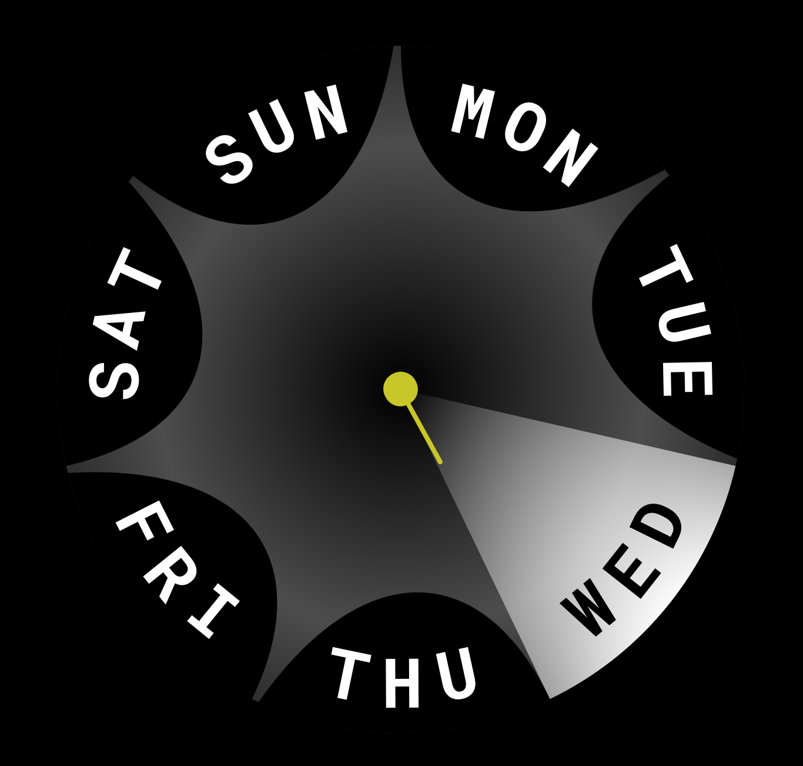

# dayclock

Demo: 
* https://dayclock.app
* https://dayclock.app/?numbers=0&color1=255,255,255&color2=200,200,0&bg=0,0,0&text=255,255,255



## Project setup
```
yarn install
```

### Compiles and hot-reloads for development
```
yarn dev
```

### Compiles and minifies for production
```
yarn build
```

### Lints and fixes files
```
yarn lint
```

### Customize configuration
See [Configuration Reference](https://cli.vuejs.org/config/).
